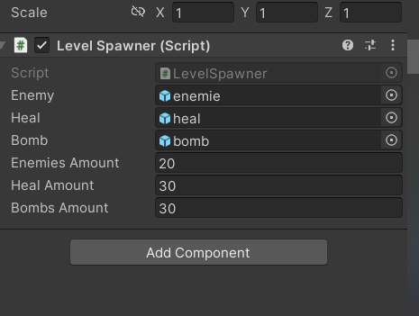

# Survivor

Este projeto foi realizado para a disciplina Inteligência Artificial para Jogos I.
O objetivo foi desenvolver um simples jogo, no qual o mundo é carregado de forma dinâmica para otimizar o processsamento, bem como os NPCs são controlados por máquina de estado finita.

## Como Jogar

### Execução
O jogo está disponível no seguinte link:

### Controles
Para jogar o jogo, é necessário um teclado. Os comandos do jogo estão na seguinte tabela:
|Ação |Controle
|-----|----------
|Andar|`Setas do teclado ou W,A,S,D`     
|Atacar|`Barra de Espaço`

## Implementação do Mundo
O mundo foi elaborado seguindo os conceitos de Malhas Regulares. Basicamente, se trata de uma matriz 3x3. Para a representação de cada célula, foi criado um Game Object vazio localizado na posição da célula. Com isso, foi possível calcular a distância do Player até a célula e então ativar ou desativar a célula e todos os Game Objects dentro dela.

## Controle dos NPCs
Para a programação dos NPCs, foi usado o conceito de Máquinas de Estado Finita.

O seguinte diagrama exemplifica a transição de estados:

### On Guard
No estado On Guard, o NPC ficará ativo e alerta. Assim que uma colisão ocorre, ele vai para o estado de **Kill Player**.

### Kill Player
No estado Kill Player, o NPC persegue o jogador até que ele saia do seu raio de visão. No caso de a vida dele ficar abaixo de 50 pontos, ele muda de estado para o **To Scape**.

### To Scape
No estado To Scape, o NPC se move na direção oposta à direção que o jogador está se movendo até que o jogador saia do seu campo de visão. Uma vez que isso acontece, o inimigo volta ao estado **On Guard**.

# Spawner

O mapa é gerado aleatoriamente toda vez que o jogo é iniciado.
O Script que fizemos permite que sejam feitos testes de balanceamento, permitindo que possamos escolher a quantidade de inimigos, itens de cura e de dano.

